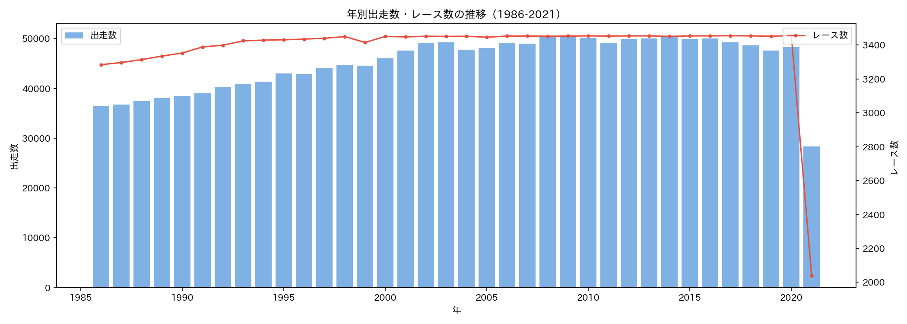
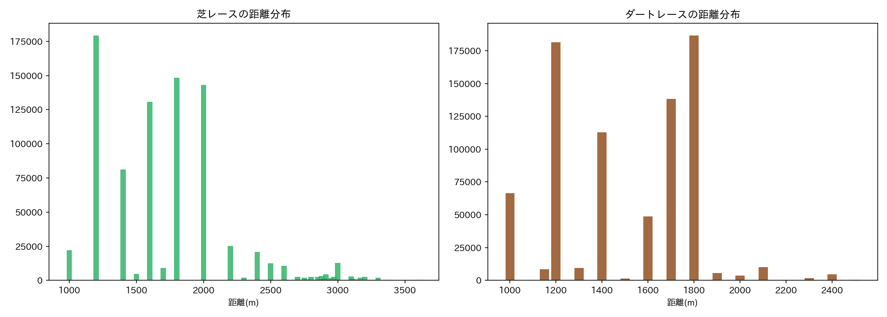
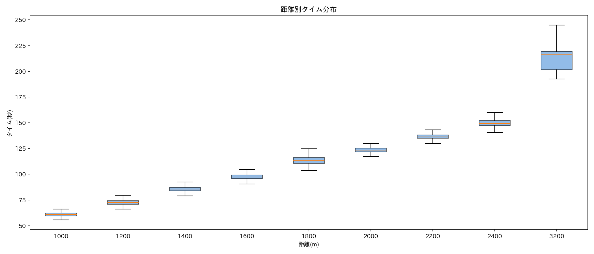
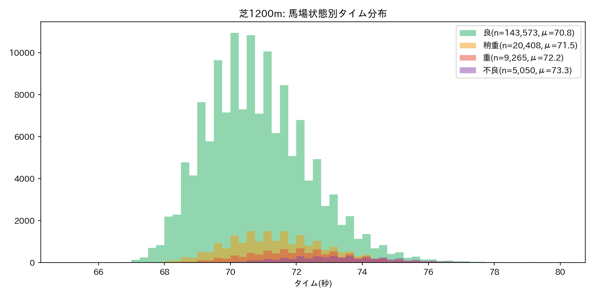
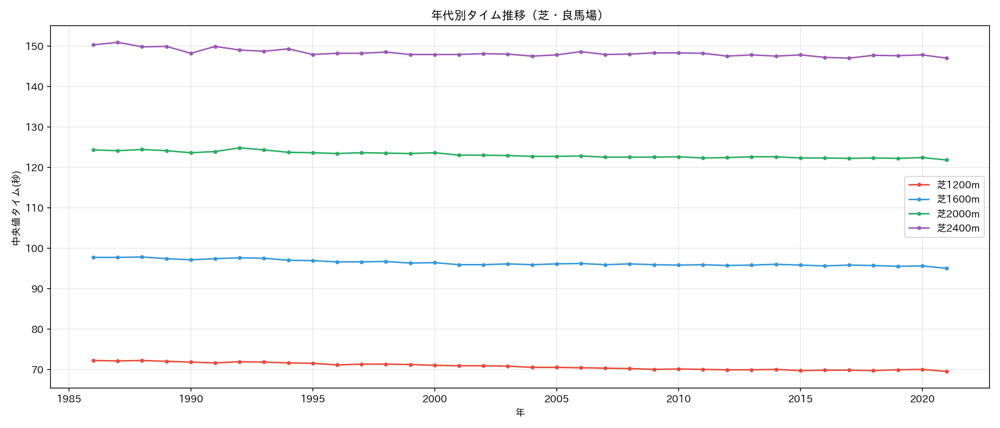
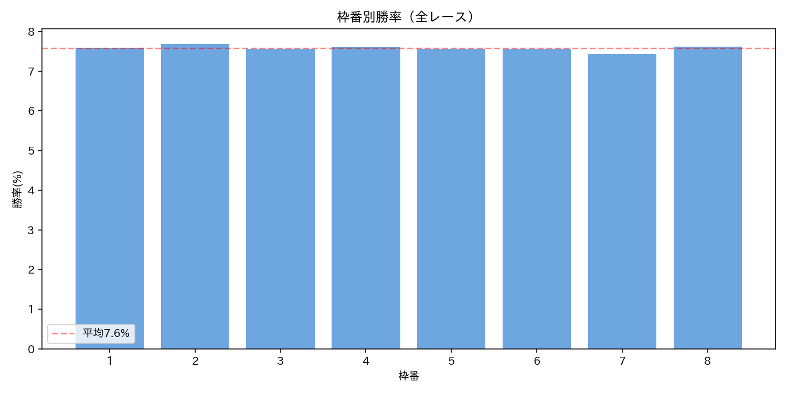
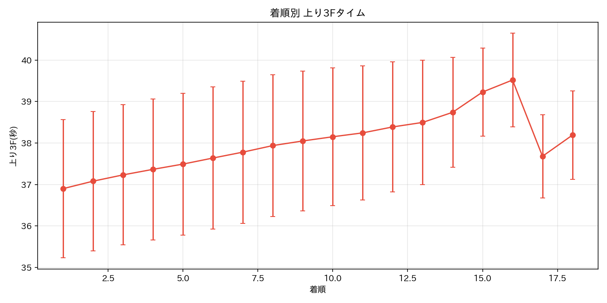
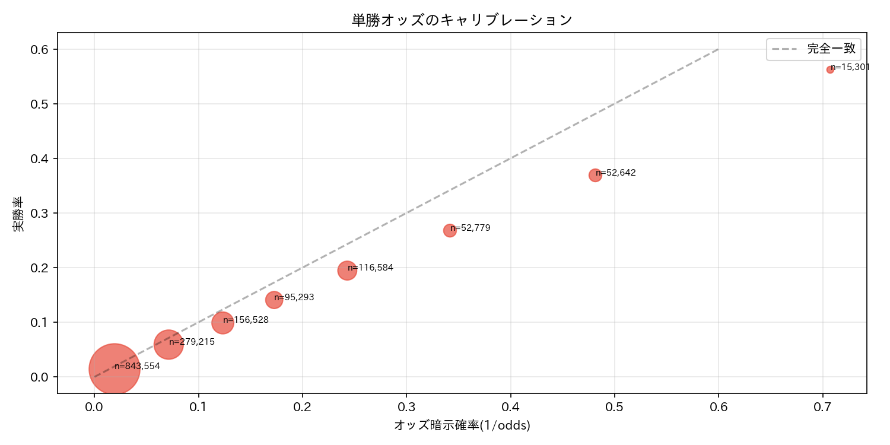
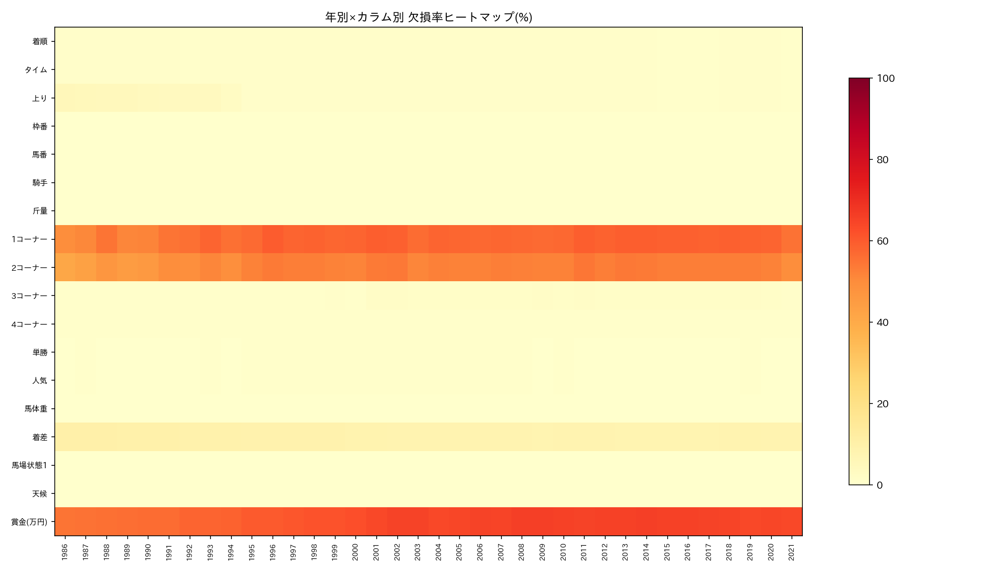

# 📊 EDA: JRA Race Result（共通基盤分析）

> **データ**: `data/jra-horse-racing-dataset/race_result` (1986-2021)
> **対象**: 全モデル共通（Model 1〜4）
> **作成日**: 2026-02-22

---

## 1. データ概要

| 項目 | 値 |
|------|-----|
| 総レコード数 | 1,626,811 |
| カラム数 | 66 |
| 期間 | 1986-01-05 〜 2021-07-31（35.5年） |
| ユニークレース数 | 121,938 |
| ユニーク馬名数 | 147,495 |
| ユニーク騎手数 | 1,249 |
| 競馬場 | JRA全10場（東京、中山、京都、阪神、札幌、函館、福島、新潟、中京、小倉） |

※ 2021年は7月末まで（約28,000レコード、他年の6割程度）

---

## 2. 年別推移

**所見**:
- レース数は年間約3,450で安定（1986〜2021）
- 出走数は1986年の36,000→2009年の50,000まで増加傾向、以降横ばい
- 1頭あたり出走数の増加 → 多頭数レースの増加を示唆

---

## 3. 距離分布

**所見**:
- **芝**: 1200m、1600m、1800m、2000mに集中。短距離〜中距離が主流
- **ダート**: 1200m、1700m、1800mに集中。1700mはダート特有の距離
- 障害レース（2700m以上）は少数だが存在

---

## 4. タイム分析

### 4.1 距離別タイム分布

**距離別タイム統計（全芝ダート混合）**:

| 距離 | 平均(s) | 中央値(s) | 標準偏差(s) | n |
|------|---------|----------|-----------|---|
| 1200m | 72.6 | 72.5 | 2.41 | 358,419 |
| 1600m | 97.7 | 97.4 | 2.67 | 178,194 |
| 1800m | 113.6 | 113.6 | 3.79 | 332,618 |
| 2000m | 123.7 | 123.5 | 2.61 | 145,534 |
| 2400m | 150.3 | 149.2 | 4.25 | 25,165 |

### 4.2 馬場状態の影響

**芝1200mでの馬場状態効果**: 良→不良で平均タイムが遅くなる傾向。
馬場状態は全モデルの重要な共変量。

### 4.3 年代別タイム推移

**所見**:
- 1990年代〜2000年代にかけて全距離で高速化傾向
- 2010年代以降は概ね安定（高速化の天井に到達？）
- **Model 1（物理モデル）への示唆**: 年代による走路改善・育種改良をパラメータに反映する必要あり

---

## 5. 枠順効果

**所見**:
- 全体ではほぼフラット（平均約7.5%付近）
- Stokes et al.が示した内枠有利の傾向は、距離×コース形態で層別しないと見えにくい可能性
- **TODO**: 距離別・コース別・芝ダート別の層別分析が必要

---

## 6. 上り3F（ラスト3ハロン）

**所見**:
- 着順と上り3Fに明確な正の相関（上位ほど上りが速い）
- 1着と18着で約3秒の差
- 上り3Fは全モデルの重要特徴量候補
- **欠損率**: 1.6%（ほぼ全レコードで利用可能）

---

## 7. オッズのキャリブレーション

**所見**:
- オッズ暗示確率と実勝率は概ね一致（市場の効率性）
- 高確率帯（本命馬）でやや過大評価傾向 → favorite-longshot biasの逆パターン
- **Model 3（GA）への示唆**: オッズをベースラインとして、それを上回る予測ができるかがベンチマーク

---

## 8. 欠損値分析

### 主要カラムの欠損パターン

| カラム | 欠損率 | 原因 |
|--------|--------|------|
| **着順** | 0.9% | 出走取消・競走中止 |
| **タイム** | 0.9% | 同上 |
| **上り** | 1.6% | 初期年代でやや高い(5.1%@1986) |
| **1コーナー** | 57.1% | **短距離レースに1コーナーなし**（1600m以下で100%欠損） |
| **2コーナー** | 51.5% | 同上（1600m以下で大半欠損） |
| **3コーナー** | 1.2% | ほぼ完備 |
| **4コーナー** | 0.6% | ほぼ完備 |
| **賞金** | 62.5% | **6着以下は賞金なし**（欠損ではなくNULL=0円） |
| **単勝** | 0.4% | ほぼ完備 |
| **馬体重** | 0.3% | ほぼ完備 |

### 重要な発見

1. **1・2コーナー通過順の大量欠損は構造的**: 短距離レースではそもそもコーナーが少ない。特徴量として使う場合は距離条件で分岐が必要
2. **賞金の欠損は意味的NULL**: 6着以下=0円として補完可能
3. **コアな予測カラム（タイム、上り、単勝、馬体重、3・4コーナー）は99%以上完備** → 前処理で大きな問題なし

---

## 9. 未取得データ（LFSポインタのまま）

| ファイル | サイズ | 状態 |
|---------|--------|------|
| laptime.csv | 14MB | LFS未取得 |
| odds.csv | 21MB | LFS未取得 |
| corner_passing_order.csv | 8.2MB | LFS未取得 |
| horse-racing-in-japan.csv | 936MB→分割取得済 | ✅結合可能 |

→ laptime, odds, corner_passing_orderは小さいのであべちゃん側で直接アップロードすれば解決

---

## 10. 次のステップ

### EDA Phase 2（予定）
- [ ] 競馬場×距離×芝ダート別の層別分析
- [ ] 騎手・調教師の勝率ランキングと時系列変化
- [ ] horse-racing-in-japan.csvとの結合・比較
- [ ] コーナー通過順 → 着順の相関分析（脚質分類への基盤）
- [ ] laptime/odds/corner_passing_orderの取り込みと結合

### モデル別の着手
- [ ] **Model 1**: タイムの物理的分解（距離÷タイム→平均速度、上り3F→終盤加速）
- [ ] **Model 2**: 特徴量エンジニアリングのベース設計
- [ ] **Model 3**: オッズベースラインの構築（NDCG@3算出）
- [ ] **Model 4**: 五行属性の付与テスト

---

*Generated by STRIDE FUTURE EDA Pipeline v0.1*
