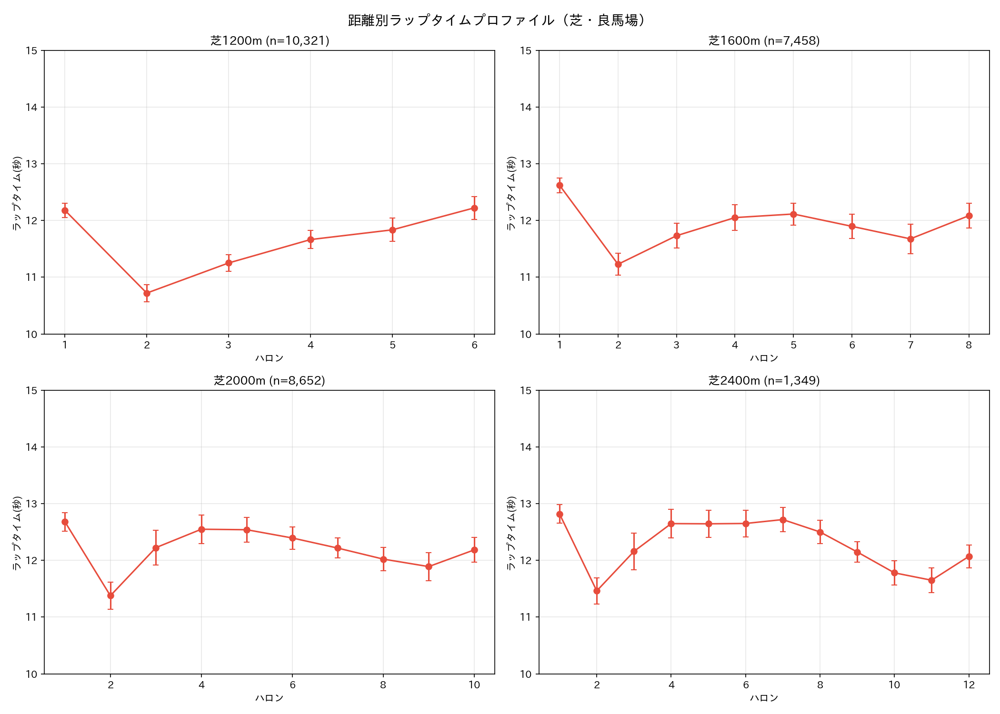
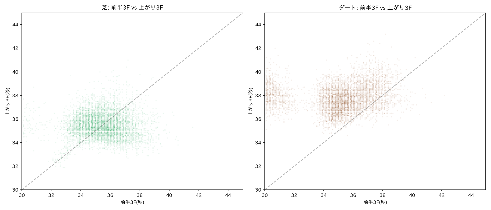
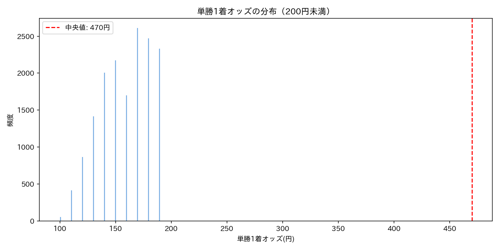

# 📊 EDA Phase 1.5: laptime / odds / corner_passing_order

> **追加3ファイルの分析**
> **作成日**: 2026-02-22

---

## 1. ファイル概要

| ファイル | 行数 | サイズ | 期間 | JOIN先 |
|---------|------|--------|------|--------|
| laptime.csv | 121,938 | 14MB | 1986-2021 | レースID → race_result (100%一致) |
| odds.csv | 121,938 | 22MB | 1986-2021 | レースID → race_result (100%一致) |
| corner_passing_order.csv | 66,204 | 8.2MB | 2002-2021 | レースID → race_result (100%一致) |

3ファイルとも**レース単位**（1行=1レース）。race_resultは**出走馬単位**（1行=1出走）なので、JOINは1:Nになる。

---

## 2. laptime（ラップタイム）

### 構造
- ラップタイム1〜18（ハロン=200m単位のタイム）
- ペース1〜18（累積タイム）
- 前半3ハロン / 上がり3ハロン

### 距離 → ラップ数の対応

| 距離 | ラップ数 | 説明 |
|------|---------|------|
| 1000m | 5 | 5ハロン |
| 1200m | 6 | 6ハロン |
| 1400m | 7 | 7ハロン |
| 1600m | 8 | マイル |
| 1800m | 9 | |
| 2000m | 10 | 中距離 |
| 2400m | 12 | クラシック |

→ 1ハロン = 200m。距離÷200 = ラップ数（完全一致）

### ペース分析の発見

**芝はイーブンペース、ダートは前傾**: 
- 芝: 前半3F 24.72s vs 上がり3F 24.78s（差-0.05s、ほぼイーブン）
- ダート: 前半3F 24.09s vs 上がり3F 25.94s（差-1.85s、明確な前傾）

→ **Model 1への示唆**: ダートは前半の消耗が大きい物理モデルが必要。芝とダートで速度プロファイルの形が根本的に異なる。

### ラップタイムプロファイル



**所見**:
- 典型的なU字型（スタート→巡航で安定→ラスト加速/減速）
- Stokes et al.のb-spline速度プロファイルと整合
- 距離が長いほど中盤の「巡航区間」が延びる

### 前半3F vs 上がり3F



**所見**:
- 芝は対角線付近に散布（前半と上がりがバランス）
- ダートは上がり3Fが遅い側にシフト（前傾ペースの証拠）

---

## 3. odds（オッズ）

### 券種と利用可能期間

| 券種 | 導入年 | 有効レース数 |
|------|--------|------------|
| 単勝 | 1986〜 | 121,938 (100%) |
| 複勝 | 1986〜 | 121,929 (100%) |
| 枠連 | 1986〜 | 120,350 (98.7%) |
| 馬連 | 1991〜 | 99,466 (81.6%) |
| ワイド | 1999〜 | 74,329 (61.0%) |
| 馬単 | 2002〜 | 65,988 (54.1%) |
| 三連複 | 2002〜 | 66,012 (54.1%) |
| 三連単 | 2004〜 | 49,542 (40.6%) |

### 三連単オッズの統計
- 平均: 149,039円
- 中央値: 30,165円
- 最大: 29,832,950円（約3000万円！）



### Model 3（GA）への示唆
- 2004年以降なら三連単まで全券種揃う
- 三連単の中央値3万円 → 的中すれば高回収率
- **ベースライン**: 人気順（1-2-3番人気）での三連単的中率を算出すべき

---

## 4. corner_passing_order（コーナー通過順）

### 構造
- 2002年以降のみ（66,204レース）
- テキスト形式: `(*13,6)4,10-2,9,12,3(7,11)1=8,5`
  - `()` = 並走（同時にコーナー通過）
  - `*` = 先頭
  - `-` = 差がある
  - `=` = 大差
  - 数字 = 馬番

### 欠損パターン（race_resultと同じ傾向）

| コーナー | 有効率 | 理由 |
|---------|--------|------|
| 1コーナー | 44.2% | 短距離レースに1コーナーなし |
| 2コーナー | 49.7% | 同上 |
| 3コーナー | 99.2% | ほぼ完備 |
| 4コーナー | 99.2% | ほぼ完備 |

### 脚質分類への活用
4コーナー通過順位 × 最終着順で脚質を分類可能:
- **逃げ**: 4コーナー1番手 → 好着順
- **先行**: 4コーナー2〜4番手 → 好着順
- **差し**: 4コーナー5〜10番手 → 着順上昇
- **追込**: 4コーナー10番手以降 → 大幅着順上昇

→ **Model 1（物理モデル）への示唆**: 4コーナー通過順位を「レース中の位置エネルギー」として物理モデルに組み込める

---

## 5. データ結合戦略

```
race_result (1,626,811行 / 馬単位)
  ├── JOIN ON レースID → laptime (121,938行 / レース単位) ... 1:N
  ├── JOIN ON レースID → odds (121,938行 / レース単位) ... 1:N  
  └── JOIN ON レースID → corner_passing_order (66,204行 / レース単位) ... 1:N
```

### 推奨: モデル学習用データの期間

| 用途 | 期間 | レース数(概算) | 備考 |
|------|------|---------------|------|
| 全データ | 1986-2021 | 121,938 | laptime+odds完備 |
| 三連単あり | 2004-2021 | ~50,000 | 全券種揃う |
| corner付き | 2002-2021 | ~66,000 | 脚質分析可能 |
| **推奨** | **2004-2021** | **~50,000** | **全データ揃う最大期間** |

---

*Generated by STRIDE FUTURE EDA Pipeline v0.1.5*
